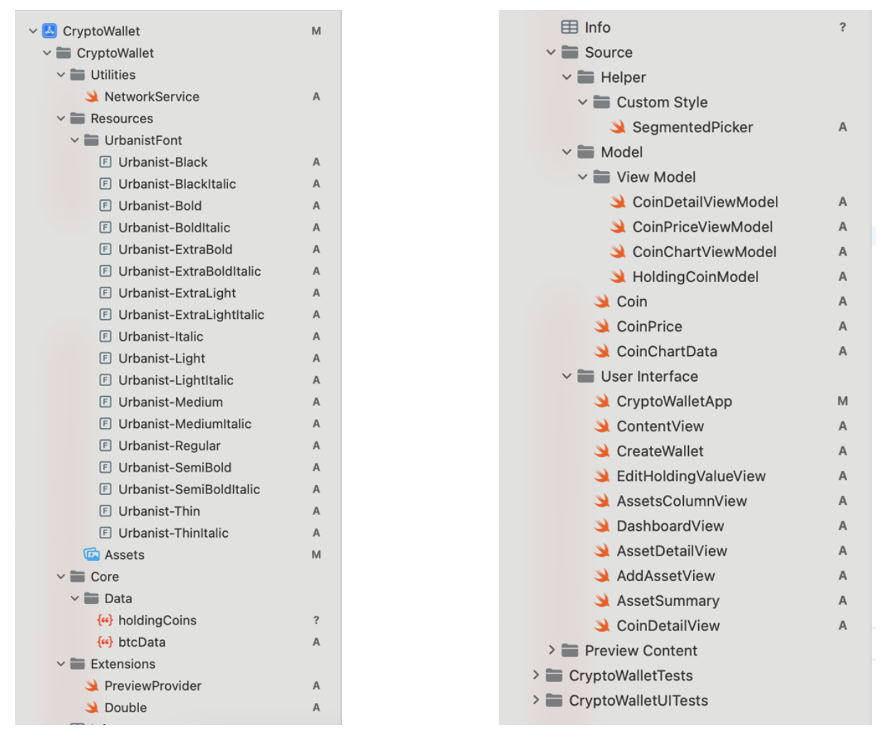
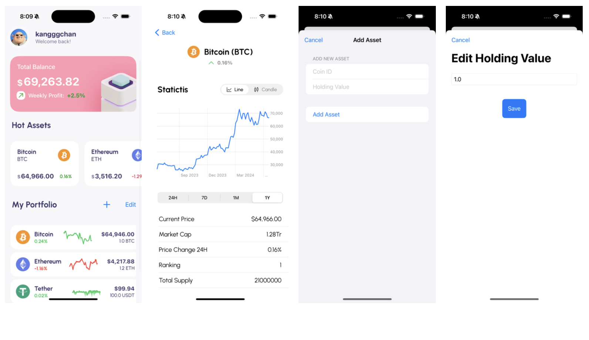
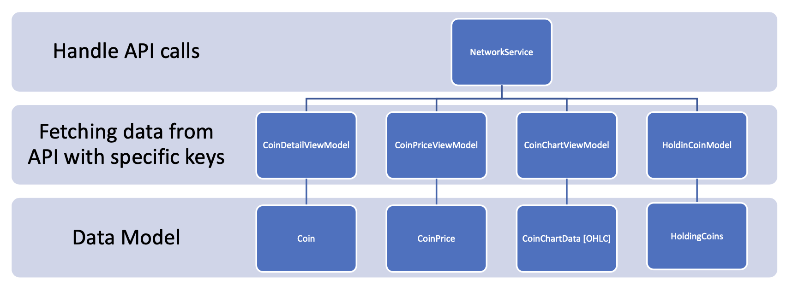

# CryptoWallet – Final Report

**Author**: Bui Phuoc Khang – 배복캉 (2021117446)  
**Department**: Computer Science and Engineering, Kyungpook National University  
**Course**: [2024-1, COMP0420-001 MOBILE APP PROGRAMMING 2] 

[YouTube Demo Video](https://www.youtube.com/watch?v=koU1j5fnCtg&ab_channel=Kangggchan%EA%B0%95%EC%9E%94)

---

## I. Source Structure
  <!-- Replace # with the path to your source structure image -->

---

## II. UI/UX Design

---

## III. Network Services
- **NetworkService**: Handles API calls and data fetching with specific keys.
- **Data Models**:
  - **CoinDetailViewModel**: Manages details of individual coins.
  - **Coin**: Represents a coin entity.
  - **CoinPriceViewModel**: Manages real-time coin prices.
  - **CoinPrice**: Holds coin price information.
  - **CoinChartViewModel**: Manages chart data (OHLC).
  - **CoinChartData [OHLC]**: Stores open-high-low-close data.
  - **HoldingCoinModel**: Manages user-held coins.
  - **HoldingCoins**: Tracks holdings and quantities.

---
## IV. Future Development

### 1. Add a Login System
- **Feature**: Implement a secure login system to protect user data and offer a personalized experience.
- **Implementation**: Develop a backend with a database for managing user accounts, authentication, and authorization.
- **Security**: Utilize industry-standard encryption and multi-factor authentication.

### 2. Deploy the App
- **Testing**: Conduct unit tests, integration tests, and user acceptance testing.
- **Beta Release**: Launch a beta version for feedback and improvements.
- **App Store Submission**: Adhere to Apple’s guidelines, including documentation and assets.
- **Post-Launch Support**: Monitor performance, address user feedback, and release updates for improved functionality and security.

---

Thank you for reviewing my project report!
